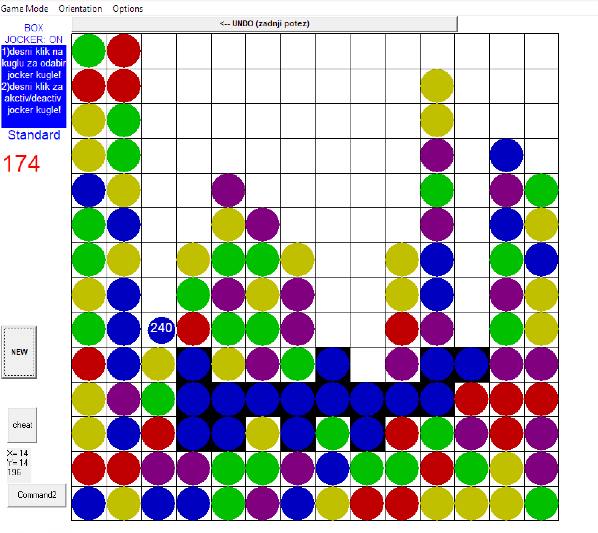

# Clix

A **Visual Basic 6** desktop clone of **Jawbreaker**, the SameGame-style puzzle bundled with Windows Mobile 2003 (also known as *Bubble Breaker* on later releases). Gameplay reference: [Jawbreaker (Windows Mobile game) — Wikipedia](https://en.wikipedia.org/wiki/Jawbreaker_(Windows_Mobile_game)).

Clear connected groups of same-colored “balls” (`kugle`), manage scoring and special rules, and try for a high score.

**Clix was written when the author was 21** (~2006). This repository preserves the original source for historical and educational purposes.

> **Disclaimer:** This is not an official Microsoft or Oopdreams product. See [NOTICE](NOTICE) for trademark attribution.

---

## Inspiration

Clix recreates the style of **Jawbreaker** for desktop Windows in VB6: five colors, adjacent matching groups, and modes aligned with the original (**Standard**, **Continuous**, **Shifter**, **MegaShift**) as described on Wikipedia.

- **Wikipedia (canonical overview):** [https://en.wikipedia.org/wiki/Jawbreaker_(Windows_Mobile_game)](https://en.wikipedia.org/wiki/Jawbreaker_(Windows_Mobile_game))

---

## Features

- **Game modes** (from the **Game Mode** menu): Standard, Continuous, Shifter, MegaShift  
- **Board layouts** (from **Orientation**): Portrait **11×12**, Landscape **15×8**, Box **14×14**  
- **Jocker ball** — special ball behavior (hint on the main form; right-click interactions as documented in-game)  
- **Optional grid** overlay  
- **Undo** last move  
- **Score** display and ball-color counters  
- Short **splash** screen on startup (`frmSplashScreen`)

UI strings and many comments are in **Bosnian/Croatian/Serbian (Latin)**.

---

## Repository layout

```
Clix/
├── README.md           # This file
├── LICENSE             # MIT
├── NOTICE              # Trademark / inspiration disclaimer
├── .gitignore          # VB6 build artifacts and OS junk
├── .vscode/            # Optional editor theming (safe to delete)
├── bin/
│   └── Clix.exe        # Pre-built 32-bit Windows binary (clone-and-run)
└── src/
    ├── Clix.vbp        # Open this in Visual Basic 6
    ├── frmMain.frm     # Main game UI and logic
    ├── frmSplashScreen.frm
    ├── frmSlike.frm    # Helper / gallery form (minimal)
    └── modGame.bas     # Shared game options (mode, orientation, grid flag)
```

There are **no third-party ActiveX controls** referenced in the project file: the game uses standard VB6 controls (e.g. `Shape`, `Line`, `Label`, menus).

---

## Requirements

| Item | Notes |
|------|--------|
| **Windows** | Required to run **`bin/Clix.exe`**; 64-bit Windows runs this 32-bit build |
| **Visual Basic 6** | Only if you want to **build from source** (with **SP6** recommended) |
| **Runtimes** | VB6 apps need the **Visual Basic 6 runtime** where you run `Clix.exe` (often already present on older Windows; install the runtime if the app fails to start) |

macOS/Linux: run the pre-built game in a **Windows VM** (or similar). The VB6 **IDE** does not run natively on macOS/Linux; use a Windows VM for development.

---

## Run (pre-built)

1. Clone or download this repository on **Windows**.  
2. Run **`bin/Clix.exe`** (double-click or from a command prompt).  

If Windows reports a missing DLL or the executable will not start, install the **Visual Basic 6 runtime** (see **Requirements**).

---

## Build

**From source**

1. Copy or clone this repository.  
2. Open **`src/Clix.vbp`** in Visual Basic 6.  
3. Use **File → Make Clix.exe** (or the toolbar equivalent).  
4. By default, output is **`Clix.exe`** in the same folder as the `.vbp` (`src/`). You can change the output path in the project settings if you prefer (for example **`bin/`**).

**Checked-in binary**

The **`bin/Clix.exe`** in this repo is the pre-built game for quick runs. If you rebuild and want clone-and-run to stay up to date, replace that file and commit it.

If the IDE creates **`Clix.vbw`**, it is ignored by Git (local window positions).

---

## Screenshots



---

## License

Code is released under the [MIT License](LICENSE).

---

## Author

**Mili Hunjic** — wrote Clix at **age 21** (around **2006**); source published years later for preservation and learning.
